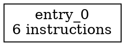

# KVRM IR Quick Start Guide

Get started with the KVRM IR system in 5 minutes.

## Installation

```bash
cd /Users/bobbyprice/projects/KVRM/kvrm-compiler
npm install
npm run build
```

## Basic Usage

### 1. Generate IR from Typed AST

```typescript
import { IRGenerator, TypedProgram } from './ir/index.js';

const program: TypedProgram = {
  functions: [{
    name: 'add',
    parameters: [
      { name: 'a', type: { kind: 'i32' } },
      { name: 'b', type: { kind: 'i32' } },
    ],
    returnType: { kind: 'i32' },
    body: [{
      kind: 'return',
      value: {
        kind: 'binary',
        op: '+',
        left: { kind: 'identifier', name: 'a', type: { kind: 'i32' } },
        right: { kind: 'identifier', name: 'b', type: { kind: 'i32' } },
        type: { kind: 'i32' },
      },
    }],
  }],
  structs: [],
  globalVariables: [],
};

const generator = new IRGenerator();
const ir = generator.generate(program);
```

### 2. Optimize IR

```typescript
import { IROptimizer } from './ir/index.js';

const optimizer = new IROptimizer();
const optimizedIR = optimizer.optimize(ir);
```

### 3. Print IR

```typescript
import { printIR } from './ir/index.js';

console.log(printIR(optimizedIR));
```

**Output**:
```
fn @add(%param_a: i32, %param_b: i32) -> i32 {
entry_0:
  %0: *i32 = alloc i32
  %1: *i32 = alloc i32
  %2: i32 = load %0
  %3: i32 = load %1
  %4: i32 = add %2, %3
  return %4
}
```

### 4. Generate Statistics

```typescript
import { generateStats, printStats } from './ir/index.js';

const stats = generateStats(optimizedIR);
console.log(printStats(stats));
```

**Output**:
```
=== IR Statistics ===
Functions: 1
Basic Blocks: 1
Instructions: 6
Average Block Size: 6.00
Max Block Size: 6

Instruction Counts:
  alloc: 2 (33.3%)
  load: 2 (33.3%)
  binop: 1 (16.7%)
  return: 1 (16.7%)
```

### 5. Export Control Flow Graph

```typescript
import { generateCFGDot } from './ir/index.js';

const dotOutput = generateCFGDot(ir.functions[0]);
console.log(dotOutput);
```

**Output**:


Visualize with Graphviz:
```bash
echo "$dotOutput" | dot -Tpng -o cfg.png
```

## Run Examples

```bash
npm run build
node dist/ir/example.js
```

This will show:
- Unoptimized IR for 4 example programs
- Optimized IR
- Statistics (before and after)
- Control flow graphs

## API Reference

### IRGenerator

```typescript
class IRGenerator {
  generate(program: TypedProgram): IRProgram
}
```

### IROptimizer

```typescript
class IROptimizer {
  optimize(program: IRProgram, iterations?: number): IRProgram
  addPass(pass: OptimizationPass): void
}
```

### Optimization Passes

```typescript
import {
  ConstantFolding,
  DeadCodeElimination,
  CommonSubexpressionElimination,
  CopyPropagation,
} from './ir/index.js';

// Use individually
const folding = new ConstantFolding();
const optimized = folding.optimize(ir);

// Or use IROptimizer (runs all passes)
const optimizer = new IROptimizer();
const fullyOptimized = optimizer.optimize(ir);
```

### Printing

```typescript
import { IRPrinter, printIR, printFunction } from './ir/index.js';

// Simple printing
const output = printIR(program);

// Custom options
const printer = new IRPrinter({
  showTypes: true,
  showBlockPredecessors: true,
  showDebugInfo: false,
  indent: '  ',
});
const customOutput = printer.print(program);

// Print single function
const funcOutput = printFunction(ir.functions[0]);
```

## Common Patterns

### Building Expressions

```typescript
// Simple constant
const five: TypedExpression = {
  kind: 'number',
  value: 5,
  type: { kind: 'i32' },
};

// Binary operation: a + b
const addition: TypedExpression = {
  kind: 'binary',
  op: '+',
  left: { kind: 'identifier', name: 'a', type: { kind: 'i32' } },
  right: { kind: 'identifier', name: 'b', type: { kind: 'i32' } },
  type: { kind: 'i32' },
};

// Function call: foo(x, y)
const call: TypedExpression = {
  kind: 'call',
  functionName: 'foo',
  arguments: [
    { kind: 'identifier', name: 'x', type: { kind: 'i32' } },
    { kind: 'identifier', name: 'y', type: { kind: 'i32' } },
  ],
  type: { kind: 'i32' },
};
```

### Building Statements

```typescript
// Variable declaration: let x = 42;
const letStmt: TypedStatement = {
  kind: 'let',
  name: 'x',
  type: { kind: 'i32' },
  mutable: false,
  initializer: { kind: 'number', value: 42, type: { kind: 'i32' } },
};

// Assignment: x = 10;
const assignStmt: TypedStatement = {
  kind: 'assign',
  target: { kind: 'identifier', name: 'x', type: { kind: 'i32' } },
  value: { kind: 'number', value: 10, type: { kind: 'i32' } },
};

// Return statement: return x;
const returnStmt: TypedStatement = {
  kind: 'return',
  value: { kind: 'identifier', name: 'x', type: { kind: 'i32' } },
};
```

### Building Control Flow

```typescript
// If statement: if (x > 0) { return 1; } else { return 0; }
const ifStmt: TypedStatement = {
  kind: 'if',
  condition: {
    kind: 'binary',
    op: '>',
    left: { kind: 'identifier', name: 'x', type: { kind: 'i32' } },
    right: { kind: 'number', value: 0, type: { kind: 'i32' } },
    type: { kind: 'bool' },
  },
  thenBody: [{
    kind: 'return',
    value: { kind: 'number', value: 1, type: { kind: 'i32' } },
  }],
  elseBody: [{
    kind: 'return',
    value: { kind: 'number', value: 0, type: { kind: 'i32' } },
  }],
};

// While loop: while (i < 10) { i = i + 1; }
const whileStmt: TypedStatement = {
  kind: 'while',
  condition: {
    kind: 'binary',
    op: '<',
    left: { kind: 'identifier', name: 'i', type: { kind: 'i32' } },
    right: { kind: 'number', value: 10, type: { kind: 'i32' } },
    type: { kind: 'bool' },
  },
  body: [{
    kind: 'assign',
    target: { kind: 'identifier', name: 'i', type: { kind: 'i32' } },
    value: {
      kind: 'binary',
      op: '+',
      left: { kind: 'identifier', name: 'i', type: { kind: 'i32' } },
      right: { kind: 'number', value: 1, type: { kind: 'i32' } },
      type: { kind: 'i32' },
    },
  }],
};
```

### Working with Structs

```typescript
// Define struct
const pointStruct: TypedStruct = {
  name: 'Point',
  fields: [
    { name: 'x', type: { kind: 'i32' } },
    { name: 'y', type: { kind: 'i32' } },
  ],
};

// Struct literal: Point { x: 10, y: 20 }
const structLiteral: TypedExpression = {
  kind: 'structLiteral',
  structName: 'Point',
  fields: new Map([
    ['x', { kind: 'number', value: 10, type: { kind: 'i32' } }],
    ['y', { kind: 'number', value: 20, type: { kind: 'i32' } }],
  ]),
  type: { kind: 'struct', structName: 'Point' },
};

// Field access: p.x
const fieldAccess: TypedExpression = {
  kind: 'fieldAccess',
  object: { kind: 'identifier', name: 'p', type: { kind: 'struct', structName: 'Point' } },
  field: 'x',
  type: { kind: 'i32' },
};
```

## Custom Optimization Pass

```typescript
import { OptimizationPass, IRProgram, IRFunction, IRBlock } from './ir/index.js';

class RemoveNops implements OptimizationPass {
  name = 'RemoveNops';

  optimize(program: IRProgram): IRProgram {
    return {
      ...program,
      functions: program.functions.map(func => this.optimizeFunction(func)),
    };
  }

  private optimizeFunction(func: IRFunction): IRFunction {
    return {
      ...func,
      blocks: func.blocks.map(block => this.optimizeBlock(block)),
    };
  }

  private optimizeBlock(block: IRBlock): IRBlock {
    // Remove no-op instructions (example: x = x + 0)
    const optimized = block.instructions.filter(instr => {
      if (instr.kind === 'binop' && instr.op === 'add') {
        // Check if adding zero (simplified example)
        return true; // Keep for now
      }
      return true;
    });

    return {
      ...block,
      instructions: optimized,
    };
  }
}

// Use the custom pass
const optimizer = new IROptimizer();
optimizer.addPass(new RemoveNops());
const optimized = optimizer.optimize(ir);
```

## Debugging Tips

### Visualize IR at Each Stage

```typescript
console.log('=== Original IR ===');
console.log(printIR(ir));

console.log('\n=== After Constant Folding ===');
const folded = new ConstantFolding().optimize(ir);
console.log(printIR(folded));

console.log('\n=== After Dead Code Elimination ===');
const dce = new DeadCodeElimination().optimize(folded);
console.log(printIR(dce));
```

### Check Statistics

```typescript
const before = generateStats(ir);
const after = generateStats(optimizedIR);

console.log('Instructions before:', before.totalInstructions);
console.log('Instructions after:', after.totalInstructions);
console.log('Reduction:', before.totalInstructions - after.totalInstructions);
```

### Export CFG for Each Function

```typescript
for (const func of ir.functions) {
  const dot = generateCFGDot(func);
  console.log(`\n=== CFG for ${func.name} ===`);
  console.log(dot);
}
```

## Next Steps

1. **Read the README**: Full documentation at `src/ir/README.md`
2. **Run Examples**: See `src/ir/example.ts` for complete examples
3. **Implementation Details**: Check `src/ir/IMPLEMENTATION_SUMMARY.md`
4. **Integrate**: Connect with parser and code generator when ready

## Support

For issues or questions:
- Check `README.md` for detailed documentation
- Review `example.ts` for working code samples
- Examine `IMPLEMENTATION_SUMMARY.md` for design decisions

Happy compiling! 🚀
